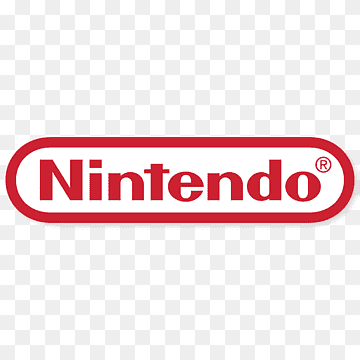

# Nintendo Product Page - Super Mario

Welcome to the Nintendo Product Page for the iconic game, Super Mario! This project is a part of FreeCodeCamp's Product Page challenge and showcases information about Nintendo and its famous character, Mario.

## Table of Contents
- [Introduction](#introduction)
- [History of Nintendo](#history-of-nintendo)
- [Super Mario Game Series](#super-mario-game-series)
- [Products](#products)
- [How to Use](#how-to-use)
- [Contributing](#contributing)
- [License](#license)

## Introduction

Nintendo Co., Ltd. is a Japanese multinational consumer electronics and video game company known for its innovation and iconic gaming franchises. This project focuses on one of its most beloved characters - Mario. Explore the history, games, and products associated with this gaming legend.

## History of Nintendo

Learn about Nintendo's fascinating journey from its origins as a playing card business in 1889 to becoming a global powerhouse in the gaming industry. Discover how the company navigated through challenges, diversified its offerings, and left a lasting impact on entertainment.

## Super Mario Game Series

Delve into the world of Super Mario, Nintendo's flagship game series. Follow Mario's adventures across imaginative worlds, from his debut in 1985 to the present day. Experience the iconic platforming gameplay, meet memorable characters, and uncover the cultural impact of this legendary franchise.

## Products

Explore Nintendo's popular products, including consoles and games:
- **Nintendo Switch:** The versatile gaming console that offers both home and handheld gaming experiences.
- **Nintendo 3DS:** The handheld gaming system that brought glasses-free 3D gaming to the masses.
- **Super Mario Games:** Dive into the world of Super Mario with various titles that have defined gaming for generations.

